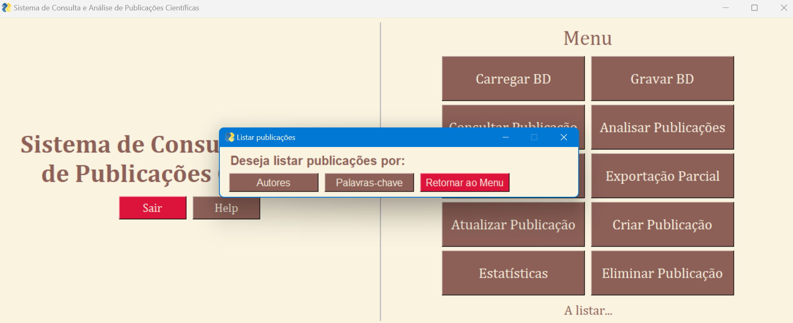
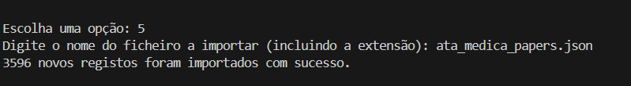

# Relatório Sistema de Consulta e Análise De Publicações Científicas
## Algoritmos e técnicas de programação
## Licenciatura em Engenharia Biomédica
### Autores: Clara Carvalho A107195, Inês Freitas A107240, Maria Carneiro A107242
### Docentes: José Carlos Ramalho, Luís Filipe Cunha

#### Índice
1. [Introdução](#introdução)
2. [Requisitos do Sistema](#requisitos-do-sistema)
    - 2.1.[Carregar Base de Dados](#carregar-base-de-dados)
    - 2.2 [Guardar Base de dados](#guardar-base-de-dados)
    - 2.3 [Consultar Publicação](#consultar-publicação)
    - 2.4 [Analisar Publicação](#analisar-publicação)
    - 2.5 [Importar Dados](#importar-dados)
    - 2.6 [Exportação Parcial ](#exportação-parcial)
    - 2.7 [Atualizar Publicação](#atualizar-publicação)
    - 2.8 [Criar Publicação](#criar-publicação)
    - 2.9 [Estatística](#estatística)
    - 2.10 [Eliminar Publicação](#eliminar-publicação)
3. [Projeto Sistema de Análise de Publicações Científicas](#projeto-sistema-de-análise-de-publicações-científicas)
    - 3.1 [Janela Principal](#janela-principal)
    - 3.2 [Fluxo de execução](#fluxo-de-execução)
    - 3.3 [Janela de Ajuda](#janela-de-ajuda)
4. [Módulos](#módulos)
5. [Conclusão](#conclusão)

### Introdução
O presente projeto tem como objetivo o desenvolvimento de um sistema em Python para consulta, armazenamento e análise de publicações científicas. Este sistema, integrado na unidade curricular de Algoritmos e Técnicas de Programação, permite a pesquisa de artigos através de filtros como título, autores, afiliações, palavras-chave e datas de publicação. Adicionalmente, o sistema possibilita a criação, atualização e eliminação de publicações, bem como geração de gráficos que analisam métricas relevantes como a frequência de palavras-chave ou o número de publicações por autor e por ano.

O projeto inclui a implementação de duas interfaces de interação: uma interface de linha de comandos (CLI) e uma interface gráfica. Ambas devem permitir o acesso às principais funcionalidades do sistema, desde a importação e exportação de dados até à manipulação do dataset em memória persistente, armazenado num ficheiro JSON.

Este relatório detalha os requisitos e a conceção do sistema, abordando a estratégia de implementação, os algoritmos utilizados.

### Requisitos do Sistema 
- **Carregamento da Base de Dados:** O programa no arranque carrega para a memória da Base de Dados que está guardada no ficheiro de suporte à aplicação.
- **Gravar Base de Dados:** Esta opção permite ao utilizador gravar a Base de Dados após esta ser inserida no sistema.
- **Consultar Publicações:** O sistema permite pesquisar publicações por vários parâmetros. Ainda permite ordenar as publicações devolvidas por data de publicação ou por título.
- **Análise de Publicações:** O programa permite analisar as publicações por autor ou por palavras-chave. Quando selecionado analisar por autor, o sistema permite ordenar por frequência dos seus artigos publicados ou por ordem alfabética. Quando selecionado analisar por palavras-chave permite ordenar pelo seu número de ocorrência nos artigos (da mais frequente para a menos) ou por ordem alfabética.
- **Importação de Dados:** Permite importar novos dados na Base de Dados já existente.
- **Exportação Parcial de Dados:** Esta opção permite que o utilizador selecione os artigos que deseja exportar através da pesquisa do título, autor, data de publicação,afiliação ou palavras-chave. Posteriormente, é exportado para o local selecionado pelo mesmo em formato json.
- **Criação de Publicações:** A aplicação permite ao utilzador criar um artigo especificando cada parâmetro que é obrigatório.
- **Atualização de Publicações:** Nesta opção o sistema permite atualizar os parâmetros da publicação selecionada.
- **Dados Estatíticos de Publicações:** Estatísticas como distribuição de publicações por ano, número de publicações por autor e frequências de palavras-chave são apresentadas em forma de gráficos de barras  ou gráficos circulares.
- **Eliminar Publicações:** Permite eliminar publicações da Base de Dados.

### Requesitos técnicos 
- **Interface gráfica e CLI:** Foram criadas duas interfaces: Interface da Linha de Comando(CLI) e Interface Gráfica, implementada com o FreeSimpleGUI.

### Algoritmo
#### Estrutura de dados
As publicações científicas são armazenadas como uma lista de dicionários, onde cada dicionário representa uma publicação individual. Estes dicionários incluem chaves como abstract, keywords, authors, doi, pdf, publish_date, title e url, cujos valores são geralmente strings. A exceção é a chave authors, que contém uma lista de dicionários, sendo que cada um descreve um autor com atributos como name e affiliation. Embora nem todas as chaves sejam obrigatórias, a chave title está presente em todas as publicações.

#### Módulos
O primeiro passo consistiu em importar os  módulos necessários para o desenvolvimento do código. Foram importados módulos em json(*import json*) bem como os módulos necessários para a resolução de gráficos(*import matplotlib.pyplot as plt*),(import threading as mp) e janelas (*import FreeSimpleGUI as sg*). Por fim, foram importadas as funções definidas num ficheiro .py, para o ficheiro .py  onde se localiza a interface (*import Funções as fc*).

#### Linha de comandos
O utilizador tem a possibilidade de escolher o modo que prefere utilizar a aplicação. Para tal, foram definidas duas funções: interface_grafica() para a interface gráfica e interface_comandos() para a linha de comandos.

### Projeto Sistema de Análise de Publicações Científicas

#### Janela Principal
A janela principal da interface gráfica é definida pela função interface_grafica(), que constitui o menu de opções do sistema. A estrutura desta janela está organizada em dois grandes blocos: à esquerda estão o nome da aplicação bem como um botão de ajuda e um de saída, e à direita estão os botões que permitem realizar as operações disponíveis.

#### Janela de dados
Abaixo do menu, existe uma área dedicada à visualização de mensagens de estado, como feedback sobre a execução das operações ou alertas para o utilizador.

#### Fluxo de execução
Ao abrir a janela, o sistema aguarda a interação do utilizador. Quando um botão é pressionado, o evento correspondente é processado.
Se o utilizador escolher a opção "Sair", o programa encerra a execução e fecha a janela.

A interação com os botões aciona operações como carregar dados, consultar publicações ou atualizar informações. Caso o utilizador tente realizar alguma ação sem que os dados necessários estejam carregados, uma mensagem de alerta é exibida, indicando que o ficheiro deve ser carregado primeiro.

Este fluxo e layout garantem que a interface gráfica seja intuitiva e permitem que o utilizador navegue facilmente entre as operações recebendo o devido feedback sobre as ações executadas.

#### Carregar Base de Dados
Ao pressionar o botão "Carregar BD" na interface gráfica, é aberta uma janela onde o utilizador pode selecionar um ficheiro .json no seu computador. Após a seleção, o sistema chama a função carregar_dataset(), que tem como objetivo carregar os dados desse ficheiro para a estrutura em memória (dataset).

  

A função carregar_dataset() utiliza a função open() para abrir o ficheiro selecionado e, em seguida, usa json.load() para carregar o conteúdo do ficheiro para uma variável em memória. Caso o ficheiro esteja vazio, será exibida uma mensagem de erro. Caso contrário, a função confirma o sucesso do carregamento e informa a quantidade de publicações carregadas.

#### Guardar Base de dados
Ao pressionar o botão "Guardar BD" a aplicação permite salvar a base de dados, um processo essencial para o funcionamento das funcionalidades. Até que a base de dados seja guardada, uma janela de erro lembrará o utilizador dessa necessidade. Após a gravação bem-sucedida, uma mensagem de confirmação será exibida, assegurando ao utilizador que os dados foram salvos com sucesso e estão prontos para uso. Esta abordagem garante a consistência e segurança dos dados, proporcionando uma experiência de utilização mais fluida e eficiente.

O botão está associado à função guardar_dataset(), que permite com que este execute a sua função corretamente.

#### Consultar Publicação

A aplicação permite consultar artigos com base em critérios como título, autores, afiliação, palavras-chave e data de publicação. A pesquisa apresenta resultados que correspondem aos critérios selecionados.

Ao realizar a pesquisa, se houver várias publicações correspondentes, ao clicar na de interesse, uma nova janela será aberta, mostrando as informações de forma organizada.

Quando ativados os botões, à exceção da data de publicação, são apresentadas as opções disponíveis na base de dados para o respetivo parâmetro selecionado. Para a exceção, é apresentado o botão "Escolha a data" que permite ao utilizador selecionar livremente a opção.

Caso não seja efetuada uma pesquisa coerente com a base de dados será exibida uma Janela de Erro que alertará o utilizador da falha cometida.

#### Analisar Publicação
A funcionalidade analisar publicação permite analisar as publicões por autor ou palavras-chave. Caso o utilizador selecione o botão em questão, abrirá uma janela que o permitirá observar a lista ordenada de autores/palavras-chave alfabeticamente ou pela frequência do parâmetro, opções que serão possíveis selecionar pelo próprio.

Ambos os botões estão associados a funções responsáveis por percorrer o dataset e adicionar o conteúdo que vai encontrando no valor da chave correspondente ao parâmetro selecionado a uma lista definida inicialmente como vazia, caso o parâmetro ainda não conste na lista. 

Caso seja de interesse analisar uma publicação específica, este terá oportunidade de a selecionar para que sejam exibidos numa nova janela os detalhes da mesma.

A esta funcionalidade também se encontram associadas Janelas de Erro que têm como objetivo orientar o utilizador a fazer um uso correto das opções disponibilizadas.

#### Importar Dados
A função de importar Base de Dados permite ao utilizador selecionar o ficheiro JSON a ser importado. Assim, através de um botão de navegação é possível localizá-lo. Uma vez que o utilizador clique em "Carregar", a função importar_dados() é chamada para processar e adicionar os dados do ficheiro selecionado à Base de Dados existente

Após a importação bem-sucedida, a janela de importação é fechada, e a interface principal da aplicação exibe uma mensagem de confirmação, assegurando ao utilizador que a Base de Dados foi adicionada com sucesso. Esta funcionalidade garante que a aplicação pode trabalhar com novos conjuntos de dados.

#### Exportação Parcial 
Quando o utilizador clica na opção "Exportação Parcial", o sistema apresenta uma janela para que este escolha um critério de consulta entre opções: Título, Data de Publicação, Autor, Afiliação ou Palavras-chave.

O utilizador pode então inserir um valor no campo de entrada e clicar em "Procurar" para filtrar as publicações com base no critério selecionado. Se forem encontradas publicações, estas serão exibidas, juntamente com a contagem dos resultados. Caso contrário, o sistema informará que não foram encontradas publicações.

Uma vez filtrados os dados, o utilizador tem a possibilidade de exportá-los para um ficheiro JSON. Para isso, é aberta uma nova janela onde pode escolher o local e o nome do ficheiro. Após clicar em "Salvar", os dados são exportados e uma mensagem de confirmação é exibida. Se o utilizador não inserir um nome válido ou tentar exportar sem resultados filtrados, o sistema apresenta mensagens de erro ou alerta.

A aplicação ainda garante a gestão adequada de eventos e janelas, permitindo que o utilizador cancele a operação em qualquer momento e que a interface feche de forma segura quando necessário.

#### Atualizar Publicação
Esta opção implementa um sistema de atualização das publicações, permitindo ao utilizador consultar e modificar dados específicos de cada publicação. O processo começa com a verificação da base de dados: se não estiver carregada ou se não tiver sido guardada previamente, o sistema emite um erro. 

O utilizador é então apresentado com opções para consultar a publicação por título, autor, afiliação, data de publicação ou palavras-chave. Para cada opção, o sistema solicita que insira o valor e, se encontrar resultados correspondentes, apresenta-os numa lista. O utilizador pode então selecionar uma publicação para editar. 

A edição permite alterar todos os campos disponíveis na estrutura do dataset. Nesta secção, exitem botões para adicionar ou remover autores e ainda um botão para selecionar a data diretamente do calendário. De forma a facilitar a alteração, são exibidos os detalhes característicos antes da atualização.
Antes de salvar as alterações, o código valida se todos os campos obrigatórios foram preenchidos. Caso contrário, um erro é exibido. 

Por fim, ao salvar as modificações, o sistema atualiza a Base de Dados e notifica o utilizador do sucesso na alteração da publicação. Este fluxo assegura que os dados da base estão sempre atualizados e corretamente mantidos.

#### Criar Publicação

A função criar uma nova publicação abre uma janela com um formulário detalhado para inserir as informações da mesma. O formulário inclui campos obrigatórios, característicos da estrutura do dataset. O botão "Salvar" permanece inativo até que todos os campos obrigatórios sejam preenchidos. Os autores podem ser adicionados individualmente, com nome e afiliação, utilizando um botão específico para essa função. Caso os campos de nome ou afiliação não estejam preenchidos, uma mensagem de erro será exibida.

Após preencher todos os campos obrigatórios, o utilizador pode salvar a nova publicação. A função cria um dicionário com todos os detalhes da publicação e chama a função criarpublicacao( ) para inserir os dados na Base de Dados existente. Uma mensagem de confirmação é exibida na interface principal, indicando que a publicação foi adicionada com sucesso. Esta função garante a entrada precisa e completa dos dados.

#### Estatística

A função responsável por gerar estatísticas é crucial para a análise dos dados na aplicação. A aplicação atualiza a interface para indicar que os dados estatísticos estão sendo produzidos e abre uma nova janela com várias opções de gráficos. Estas opções incluem a distribuição de publicações por ano, distribuição de publicações por mês de um ano, número de publicações por autor, distribuição de publicações de um autor por anos, distribuição de palavras-chave pela sua frequência e distribuição de palavras-chave mais frequentes por ano.

Cada opção de gráfico inicia uma thread separada para calcular e exibir os gráficos estatísticos, garantindo que a aplicação continua a responder enquanto os dados são processados. Para gráficos que requerem seleção adicional, como a distribuição por mês de um determinado ano ou por autor, janelas adicionais permitem ao utilizador especificar o ano ou o autor desejado.

#### Eliminar Publicação 

Este código permite eliminar publicações de uma base de dados. Quando o evento "Eliminar" é acionado, o utilizador pode procurar uma publicação pelos parâmetros: título, autor, afiliação, palavras-chave e data de publicação, e, se encontrada, escolher eliminá-la. Antes de eliminar, o sistema solicita confirmação. Se o utilizador confirmar, a publicação é removida da Base de Dados e a lista é atualizada; caso contrário, a operação é cancelada. Se não houver resultados ou a publicação não for selecionada, o sistema exibe mensagens de erro.

#### Janela de Ajuda

A janela de ajuda pode ser acessada a partir de qualquer parte do sistema. Ela exibe informações detalhadas sobre como utilizar cada funcionalidade do sistema, incluindo exemplos de uso e mensagens de erro comuns.

### Conclusão
Para a elaboração deste projeto, optámos por dividir as tarefas entre os membros da equipa, o que nos permitiu agilizar o processo e tirar partido das competências individuais de forma complementar. Ao longo do desenvolvimento, deparámo-nos com diversos erros inesperados. Para resolvê-los, adotámos uma abordagem colaborativa, discutindo as possíveis soluções em grupo, pesquisando alternativas e, principalmente, utilizando o método de tentativa-erro para validar as nossas hipóteses.

Os maiores desafios técnicos que enfrentámos foram alinhar e adaptar todas as janelas da aplicação para diferentes resoluções e personalizar as cores dos botões predefinidos pelas bibliotecas do Python. Apesar das dificuldades, conseguimos superar estes obstáculos com criatividade e persistência.

Podemos concluir que o resultado final do projeto está alinhado com os objetivos iniciais, satisfazendo as necessidades propostas e proporcionando uma experiência de utilização eficiente e intuitiva. Além disso, este projeto permitiu-nos aprofundar os nossos conhecimentos em programação, design de interfaces e trabalho em equipa, aspetos que serão valiosos em projetos futuros.